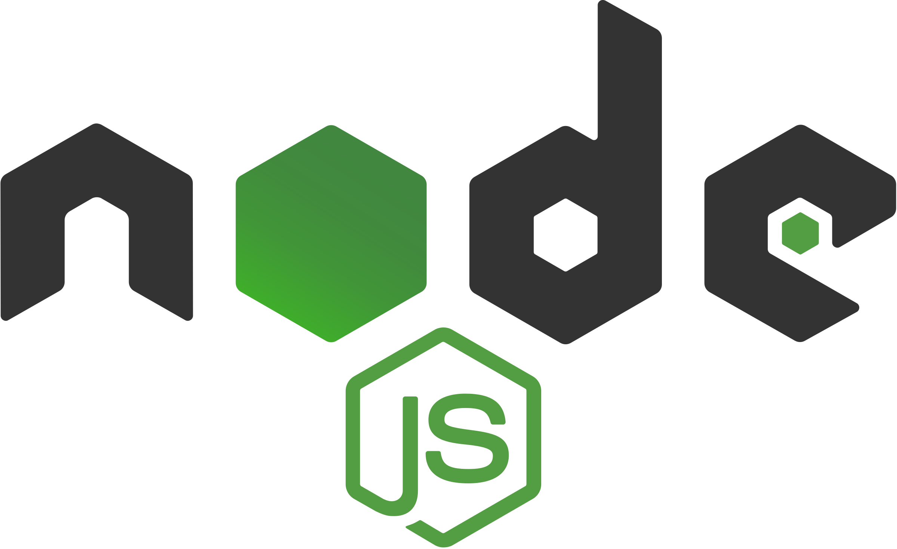

 <div style="display:flex; align-items: center">
  
</div>

---

FolkSoul is a music band platform where we can find out about the band and its members or just enjoy the visuals.
Production url: https://folksoul.sabavar.redberryinternship.ge/

#

## Table of Contents

- [Table of Contents](#table-of-contents)
- [Prerequisites](#prerequisites)
- [Tech Stack](#tech-stack)
- [Getting Started](#getting-started)
- [Testing](#testing)
- [Project Structure](#project-structure)
- [Resources](#resources)

## Prerequisites

-  <p>_Node JS @12.X and up_</p>
-  <p>_npm @6 and up_</p>

#

## Tech Stack

-  <p><a href="https://reactjs.org/" target="_blank">[React @18.2.0]</a> - front-end framework<p/>

-  <p><a href="https://www.typescriptlang.org/" target="_blank">[Typescript @4.7.4]</a> - JavaScript with syntax for types.TypeScript is JavaScript with syntax for types<p/>

-  <p><a href="https://react-hook-form.com/" target="_blank">[React Hook Form @7.32.2]</a> - flexible and extensible forms with easy-to-use validation<p/>

-  <p><a href="https://www.cypress.io/" target="_blank">[cypress @10.3.0]</a> - JavaScript End to End Testing Framework<p/>

-  <p><a href="https://tailwindcss.com/" target="_blank">[tailwindcss @3.1.3]</a> - css framework<p/>

#

## Getting Started

1\. First of all you need to clone repository from github:

```sh
git clone https://github.com/RedberryInternship/folksoul-front-Var-saba.git
```

2\. Next step requires install all the dependencies.

```sh
npm install
```

or

```sh
yarn install
```

3\. copy .env

```sh
cp .env.example .env
```

4\. after that you can run FolkSoul application from terminal:

```sh
npm start
```

Runs the app in the development mode. Open http://localhost:3000 to view it in your browser.

#

## Testing

1\. copy cypress.config.ts

```sh
cp cypress.config.ts.example cypress.config.ts
```

2\. Run application from the terminal

```sh
npm start
```

3\. start cypress

```sh
npx cypress open
```

In order to see coverage of testing go to coverage/lcov-report and open index.html

#

## Project Structure

```bash
├─── cypress
├─── readme
├─── src
│    ├── assets
│    │   ├── fonts
│    │   └── images
│    │
│    ├── components
│    │   └── svgs
│    │
│    └── pages
│        ├── About
│        ├── Dashboard
│        ├── Home
│        ├── Login
│        ├── Main
│        ├── Members
│        └── SocialLinks

- .eslintrc.json
- .gitignore
- .prettierrc.json
- cypress.config.ts
- package.json
- tailwind.config.js
- tsconfig.json

```

#

## Resources

- [Application Design [Figma]](https://www.figma.com/file/ferG8kznuy5s0hMhMZa2Hi/FolkSoul---Bootcamp?node-id=0%3A1)
- [Application Design Prototype](https://www.figma.com/proto/ferG8kznuy5s0hMhMZa2Hi/FolkSoul-Bootcamp?node-id=0%3A1&scaling=contain&page-id=0%3A1)
- [Git commit rules](https://redberry.gitbook.io/resources/git-is-semantikuri-komitebi)
- [Font [BPG Arial]](https://fonts.ge/ka/font/13/BPG-Arial)
- [Font [BPG Nino Mtavruli]](https://fonts.ge/ka/font/143/BPG-Nino-Mtavruli)
